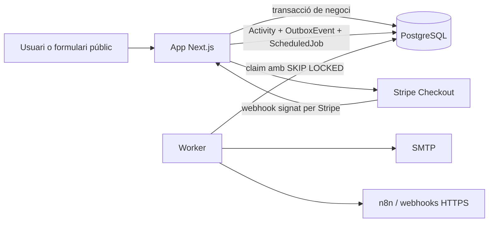

# Arquitectura

## Visió general

AImetos CRM és un monòlit modular: una sola base de codi, una sola base PostgreSQL i dos processos executables des de la mateixa imatge.

- **App**: Next.js App Router, autenticació, interfície i API HTTP.
- **Worker**: recordatoris, correu, webhooks, caducitats i reintents.
- **PostgreSQL**: dades de negoci, outbox i cua de jobs. No hi ha Redis.
- **Mailpit**: SMTP de desenvolupament; no forma part de producció.



L'App no espera n8n, SMTP ni altres destinacions externes dins d'una operació de negoci. Confirma primer la transacció local; el Worker executa els efectes secundaris després.

## Estructura del codi

| Ruta | Responsabilitat |
|---|---|
| `src/app` | Pàgines, route handlers i composició HTTP. |
| `src/modules/<domini>` | Casos d'ús i regles de negoci per domini. |
| `src/lib` | Prisma, autenticació, tenant, criptografia, imports i utilitats compartides. |
| `src/worker` | Bucle de claim, dispatch dels handlers, reintents i graceful shutdown. |
| `prisma/schema.prisma` | Font de veritat del model persistent. |
| `prisma/migrations` | Evolució versionada de l'esquema. |
| `docker` | Contracte d'arrencada dels rols `app`, `worker`, `migrate` i `seed`. |

Un mòdul pot utilitzar `src/lib`, però no ha d'importar components React ni route handlers. Les rutes validen entrada i autorització; el servei de domini executa la transacció i retorna un resultat serialitzable.

## Transaccions i outbox

Una operació que canvia l'estat comercial agrupa en una única `db.$transaction`:

1. canvi de l'entitat principal;
2. registres relacionats;
3. `Activity` o `AuditLog`, segons correspongui;
4. `OutboxEvent` amb una clau d'idempotència determinista;
5. `ScheduledJob` quan cal una execució futura.

Si la transacció falla, no existeix ni el canvi de negoci ni l'esdeveniment. El flux de formulari públic ja aplica aquest patró per crear submission, contacte, oportunitat, tasca, activitats i esdeveniments outbox.

No es crida un sistema extern des de dins de la transacció. Això evita retenir locks mentre una xarxa externa respon i elimina el cas «negoci confirmat però esdeveniment perdut».

## Contracte del Worker

El Worker és un procés independent però utilitza els mateixos tipus, Prisma Client i variables que l'App.

### Claim segur

Cada iteració selecciona un lot de `ScheduledJob` elegibles:

- `status = PENDING`;
- `runAt <= now()`;
- no cancel·lats;
- intents per sota de `maxAttempts`.

El claim es fa en una transacció PostgreSQL curta amb `FOR UPDATE SKIP LOCKED`. La mateixa sentència actualitza els jobs a `PROCESSING`, assigna `lockedAt` i `lockedBy`, incrementa `attempts` i retorna les files. El processament extern ocorre després de confirmar aquesta transacció.

Aquest patró permet diverses rèpliques sense executar normalment el mateix job en paral·lel. No converteix l'entrega externa en «exactly once»: cada handler també ha de comprovar l'estat de l'entitat i la seva clau d'idempotència.

### Estats i recuperació

```text
PENDING -> PROCESSING -> COMPLETED
                     -> PENDING     (error reintentable)
                     -> FAILED      (límit o error permanent)
PENDING/PROCESSING -> CANCELLED     (cancel·lació explícita)
```

- Èxit: `COMPLETED`, `completedAt`, lock net i error net.
- Error reintentable: torna a `PENDING`, nou `runAt`, `lastError` sanititzat i lock net.
- Límit d'intents: `FAILED`.
- `CANCELLED` mai es reclama.
- Un lease `PROCESSING` més antic que el timeout configurat es recupera abans de reclamar feina nova.

El backoff base és exponencial i limitat: 30 s, 60 s, 2 min, etc., amb màxim d'1 hora. Els handlers han de tractar una repetició després d'un crash com una situació normal.

### Aturada

En rebre `SIGTERM` o `SIGINT`, el Worker deixa de reclamar feina, permet acabar el job en curs dins del període de gràcia i tanca Prisma. El contenidor disposa d'un `stop_grace_period`; no s'ha d'utilitzar `kill -9` en un desplegament normal.

## Multi-tenant

`organizationId` és la frontera d'aïllament. `requireTenant()` deriva `organizationId`, `userId` i rol de la sessió autenticada; `requireAdmin()` afegeix el control de rol.

Regles obligatòries:

1. Tota consulta de negoci inclou `organizationId` en el `where`.
2. Un `id` rebut del client mai és suficient; es consulta com a mínim per `id + organizationId`.
3. Abans de relacionar dues entitats, es valida que pertanyen a la mateixa organització.
4. Els jobs, esdeveniments, entregues, correus, auditories i rate limits també són tenant-scoped.
5. Les rutes públiques resolen primer l'organització mitjançant una clau pública inequívoca; no accepten `organizationId` arbitrari del client.

Prisma no configura Row Level Security. L'aïllament és una responsabilitat explícita de l'aplicació, reforçada per índexs i claus úniques compostes. Les foreign keys per si soles no impedeixen relacionar IDs de tenants diferents.

## Autenticació i secrets

- Auth.js utilitza credencials locals i sessions JWT de 8 hores.
- Les contrasenyes es comparen amb hash `bcrypt`.
- El JWT transporta `organizationId` com a candidat de context, pero cada peticio autenticada torna a validar que l'usuari, la membership i l'organitzacio continuen actius i llegeix el rol vigent de PostgreSQL. Aixo fa efectiva una revocacio sense esperar que caduqui el JWT.
- No es confia en cap header de tenant enviat pel navegador.
- Els secrets només entren per variables d'entorn.
- Els secrets d'endpoints sortints s'emmagatzemen xifrats amb AES-256-GCM; la clau mestra és `INTEGRATION_ENCRYPTION_KEY`.
- Les signatures HMAC i el format d'entrega es defineixen a [WEBHOOKS.md](./WEBHOOKS.md).

## Processos i desplegament

La imatge de producció té quatre rols:

| Rol | Comanda efectiva | Vida esperada |
|---|---|---|
| `app` | servidor standalone de Next.js | Llarga |
| `worker` | `npm run worker` | Llarga |
| `migrate` | `npm run db:migrate` | Una sola execució |
| `seed` | `npm run db:seed` | Manual i controlada |

Compose espera PostgreSQL saludable, executa `migrate` una vegada i només després arrenca App i Worker. En producció, les migracions també s'executen com un pas únic abans de desplegar els processos llargs.

`/api/health` és el health check web. El Worker exposa liveness de procés, no un port HTTP. Les mètriques operatives mínimes són jobs pendents/vençuts, leases obsolets, intents, entregues fallides i antiguitat de l'esdeveniment outbox més vell.

## Decisions deliberades

- Sense microserveis: els mòduls comparteixen transaccions i tipus.
- Sense Redis: PostgreSQL cobreix cua, leases i idempotència de l'MVP.
- Sense crides externes síncrones en escriptures de negoci.
- PDFs sota demanda; no hi ha un volum de documents compartit.
- Stripe, SMTP i n8n són opcionals. La seva absència no impedeix operar el CRM.
