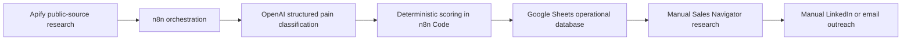

# Arquitectura

El sistema segueix aquesta cadena:

## Principis

- Google Sheets és la base de dades operacional.
- Apify només aporta fonts públiques configurades a `00_CONFIG`.
- OpenAI classifica amb JSON estricte i no assigna puntuació numèrica.
- El node `Score Lead` calcula `score`, `priority` i `next_action`.
- Sales Navigator només s'utilitza manualment després de qualificar empresa.
- Apollo queda fora del flux principal.

## Dades

`01_EMPRESAS_OBJETIVO` guarda empreses, `02_PAIN_SIGNALS` guarda evidència, `03_LEADS_CUALIFICADOS` guarda leads accionables, `04_RUN_LOG` audita execucions i `05_OUTREACH_DRAFTS` guarda esborranys revisables.
